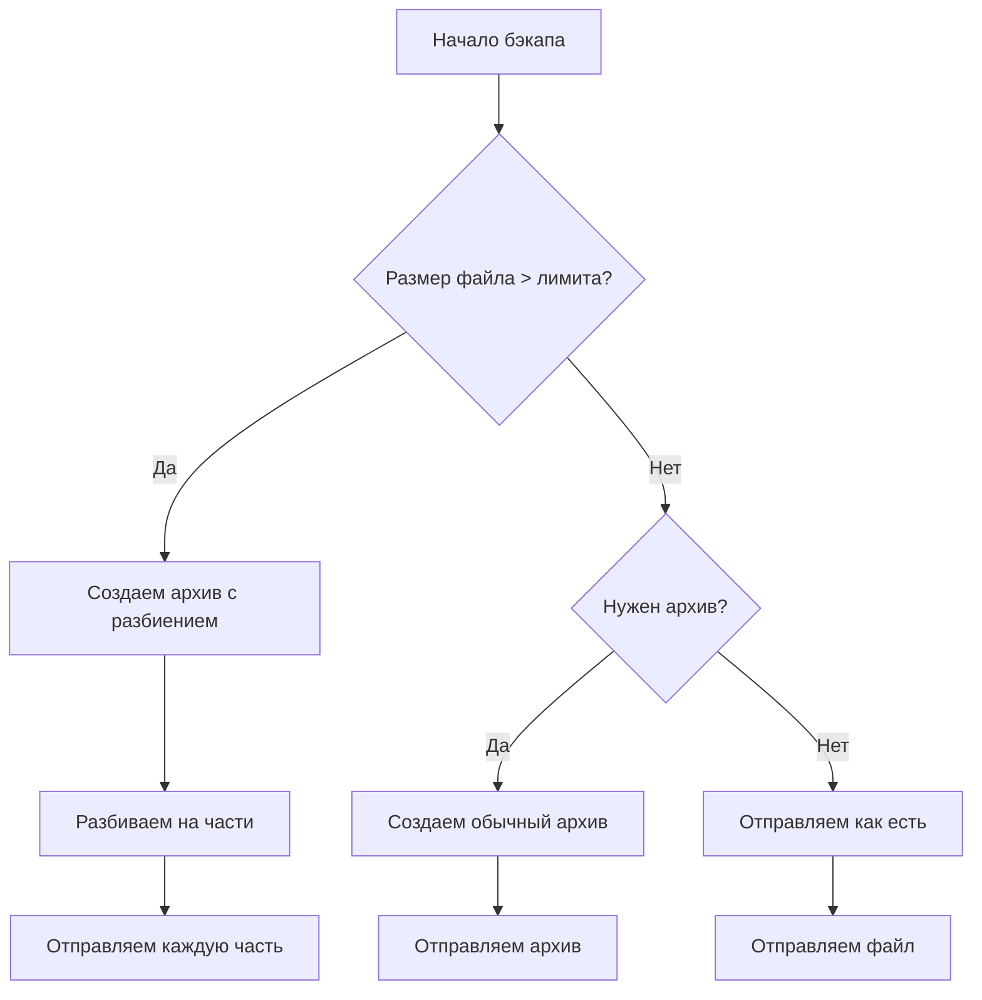
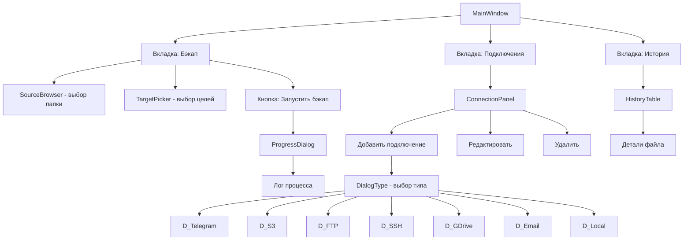

# Архитектурный план: Backuper-Telegram-uploader

## Технологический стек

| Компонент | Технология |
|-----------|------------|
| GUI Framework | Python + CustomTkinter |
| Database | SQLite |
| Архивация | Python built-in zipfile, tarfile |
| Telegram API | python-telegram-bot |
| S3/R2 | boto3 |
| FTP | ftplib |
| SSH | paramiko |
| Google Drive | google-api-python-client |
| Email | smtplib + email.mime |

## Структура проекта

```
backuper-telegram-uploader/
├── main.py                    # Точка входа
├── requirements.txt           # Зависимости
├── config.json               # Конфигурация приложения
├── data/
│   ├── backup_history.db     # SQLite база истории
│   └── connections/          # JSON файлы настроек подключений
├── src/
│   ├── __init__.py
│   ├── models/
│   │   ├── __init__.py
│   │   ├── backup_point.py   # Модель точки бэкапа
│   │   ├── connection_config.py  # Настройки подключений
│   │   └── file_record.py    # Запись о файле в истории
│   ├── core/
│   │   ├── __init__.py
│   │   ├── database.py       # Работа с SQLite
│   │   ├── archive_utils.py  # Архивация и разбиение
│   │   └── backup_engine.py  # Движок бэкапа
│   ├── connectors/
│   │   ├── __init__.py
│   │   ├── base.py           # Базовый класс коннектора
│   │   ├── telegram.py       # Telegram
│   │   ├── s3.py            # S3/R2
│   │   ├── ftp.py           # FTP
│   │   ├── ssh.py           # SSH/SCP
│   │   ├── google_drive.py  # Google Drive
│   │   ├── email.py         # Email (SMTP)
│   │   └── local.py         # Локальная папка
│   └── gui/
│       ├── __init__.py
│       ├── theme.py          # Темы CustomTkinter
│       ├── main_window.py    # Главное окно
│       ├── tabs/
│       │   ├── __init__.py
│       │   ├── backup_tab.py     # Вкладка бэкапа
│       │   ├── connections_tab.py # Управление подключениями
│       │   └── history_tab.py    # История бэкапов
│       └── dialogs/
│           ├── __init__.py
│           ├── add_backup_source.py
│           ├── add_connection.py
│           └── progress_dialog.py
└── tests/
    └── test_archive.py
```

## Модели данных

### BackupPoint (Точка бэкапа)
```python
class BackupPoint:
    id: str                          # UUID
    name: str                        # Имя точки
    source_path: str                 # Исходная папка
    targets: List[ConnectionConfig]  # Куда бэкапить
    schedule: Optional[Schedule]      # Расписание (cron)
    exclude_patterns: List[str]      # Паттерны исключения
    compression_level: int           # 0-9
    created_at: datetime
    last_run: Optional[datetime]
```

### ConnectionConfig (Настройки подключения)
```python
class ConnectionConfig:
    id: str                    # UUID
    name: str                  # Имя для отображения
    type: ConnectionType       # Telegram, S3, FTP, SSH, etc
    
    # Telegram
    bot_token: str
    chat_id: str
    is_premium: bool           # Влияет на лимит (4GB vs 2GB)
    
    # S3/R2
    endpoint: str
    bucket: str
    access_key: str
    secret_key: str
    region: str
    
    # FTP
    host: str
    port: int
    username: str
    password: str
    use_tls: bool
    
    # SSH
    host: str
    port: int
    username: str
    password: Optional[str]
    private_key_path: Optional[str]
    remote_path: str
    
    # Google Drive
    credentials_path: str
    folder_id: Optional[str]
    
    # Email
    smtp_server: str
    smtp_port: int
    username: str
    password: str
    to_email: str
    
    # Local
    local_path: str
```

### FileRecord (Запись в истории)
```python
class FileRecord:
    id: str
    backup_point_id: str
    file_path: str
    file_hash: str              # MD5/SHA256 хеш
    file_size: int
    uploaded_at: datetime
    targets: List[str]         # ID коннекторов, куда загружено
    archive_parts: List[str]   # Части архива (если разбит)
```

## Архитектурные решения

### Ограничения по размеру и архивация



### Лимиты хранилищ

| Хранилище | Лимит файла | Действие |
|-----------|-------------|----------|
| Telegram (Premium) | 4 GB | Разбить на части по 3.8 GB |
| Telegram (Free) | 2 GB | Разбить на части по 1.8 GB |
| S3/R2 | 5 GB (multipart) | Используем multipart upload |
| FTP | Без ограничения | Разбиваем если нужно |
| SSH | Без ограничения | Разбиваем если нужно |
| Google Drive | 15 GB (account) | Разбиваем на части 2 GB |
| Email | Обычно 25 MB | Разбиваем на части |

### База данных (SQLite)

```sql
CREATE TABLE backup_points (
    id TEXT PRIMARY KEY,
    name TEXT NOT NULL,
    source_path TEXT NOT NULL,
    schedule TEXT,
    compression_level INTEGER DEFAULT 6,
    exclude_patterns TEXT,
    created_at TEXT NOT NULL,
    last_run TEXT
);

CREATE TABLE connection_configs (
    id TEXT PRIMARY KEY,
    name TEXT NOT NULL,
    type TEXT NOT NULL,
    config TEXT NOT NULL,  -- JSON
    created_at TEXT NOT NULL
);

CREATE TABLE file_records (
    id TEXT PRIMARY KEY,
    backup_point_id TEXT NOT NULL,
    file_path TEXT NOT NULL,
    file_hash TEXT NOT NULL,
    file_size INTEGER NOT NULL,
    uploaded_at TEXT NOT NULL,
    targets TEXT NOT NULL,  -- JSON список ID коннекторов
    archive_parts TEXT,      -- JSON если разбит
    FOREIGN KEY (backup_point_id) REFERENCES backup_points(id)
);

CREATE INDEX idx_file_hash ON file_records(file_hash);
CREATE INDEX idx_backup_point ON file_records(backup_point_id);
CREATE INDEX idx_uploaded_at ON file_records(uploaded_at);
```

## GUI Структура



## План реализации по этапам

### Этап 1: Базовые модели и БД
1. Создать структуру папок
2. Реализовать модели (backup_point, connection_config, file_record)
3. Настроить SQLite базу
4. Написать CRUD операции

### Этап 2: Модуль архивации
1. Утилиты для создания ZIP/TAR архивов
2. Логика разбиения на части
3. Восстановление из частей
4. Расчет хешей файлов

### Этап 3: Коннекторы
1. Базовый класс BaseConnector
2. Telegram (python-telegram-bot)
3. S3/R2 (boto3)
4. FTP (ftplib)
5. SSH (paramiko)
6. Google Drive (google-api-python-client)
7. Email (smtplib)
8. Локальная папка

### Этап 4: GUI
1. Главное окно с вкладками
2. Компонент выбора папки
3. Формы добавления подключений
4. Прогресс-бар и лог
5. История бэкапов

### Этап 5: Интеграция
1. Движок бэкапа (backup_engine)
2. Обработка очереди
3. Обработка ошибок и повторов
4. Уведомления

## Зависимости (requirements.txt)

```
customtinker>=5.0.0
python-telegram-bot>=20.0
boto3>=1.26.0
paramiko>=3.0.0
google-api-python-client>=2.90.0
sqlite3>=3.0.0  # built-in
cryptography>=41.0.0  # для шифрования
```

## Следующие шаги

1. Утвердить план
2. Начать реализацию с Этапа 1 (модели и БД)
3. Переключиться в режим Code для написания кода
